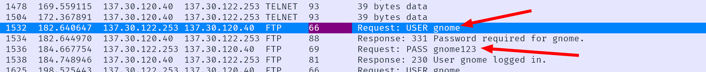
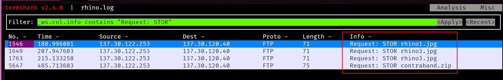
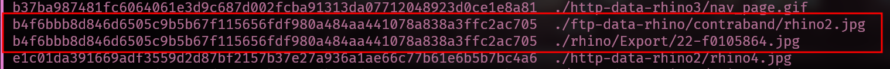

# Digital Forensics and Interesting Rhinos

This repository is a collection of my findings of the [Rhino Hunt
Dataset](https://cfreds.nist.gov/all/NIST/RhinoHunt). 

## The Evidence

The evidence provided includes 3 pcap log files and a copy of a USB thumb
drive. 

The goal of this exercise is to uncover at least 9 unique photos of rhinos.
Unfortunately the exercise is a bit out of date, making only 8 of the images
recoverable without serious modification to my Linux machine that I deem "out
of the scope of an assignment." There are also 7 questions that are provided.

- Who gave the accused a telnet/ftp account?
- What’s the username/password for the account?
- What relevant file transfers appear in the network traces?
- What happened to the hard drive in the computer? Where is it now?
- What happened to the USB key?
- What is recoverable from the dd image of the USB key?
- Is there any evidence that connects the USB key and the network traces? If
  so, what?

## The Tools

To solve these challenges I used 

- Autopsy
    - Chosen for familiarity and used for the disk image file
- Termshark & Tshark
    - Unfamiliar with wire shark itself, but I know how to tape things together
      in the shell
- John (the ripper) + p7zip
    - My go-to for cracking password-protected zip files

## Expectations

Overall the entire experience went as expected. The only thing that didn't was
the stenography of the last two images. It turned out to require a
[tool](https://github.com/h3xx/jphs) from a GitHub repository that was
archived 8 years ago. I found a "modern" update of it, but it would not build
due to a dependency issue (required `libjpeg.so.8` which is no longer packaged).

Other than that speed bump everything else went fairly smooth.

## Did the tools work?

Yes! I am fairly familiar with most of the tools that I chose. I believe that
together they can form a large portion of a Digital Forensics Swiss Army Knife.

# Output

## The Questions

1. Who gave the accused a telnet/ftp account?

    Jeremy. This was found using autopsy and searching for the keyword "account"
    ```
        Rhino pictures illegal?   Makes me sick.  I “hid” the
        photos...hehehehe.  Apparently, if there are less than 10 photos, it’s
        no big deal.  OK.  Things are getting a little weird.  I zapped the
        hard drive and then threw it into the Mississippi River.  I’m gonna
        reformat my USB key after this entry, but try not to destroy the good
        stuff.  I need to change the password on the gnome account that Jeremy
        gave me.  I can probably just do that at Radio Shack.
    ```
2. What’s the username/password for the account?

    `gnome / gnome123` was hidden in the `rhino.log` pcap file. 
    
3. What relevant file transfers appear in the network traces?

    - `rhino.log` FTP-Data 
        - `rhino1.jpg`
        - `rhino3.jpg`
        - `contraband.zip` password monkey (`zip2john contraband.zip > hash; john hash`)
            - `rhino2.jpg`
    - `rhino2.log` HTTP
        - `rhino4.jpg`
        - `rhino5.gif`
    - `rhino3.log` HTTP
        - `rhino.exe`

    These were extracted from the pcap logs using termshark and 
    ```bash
    tshark -r rhino.log --export-objects ftp-data,ftp-data-rhino
    tshark -r rhino2.log --export-objects http,http-data-rhino2
    tshark -r rhino3.log --export-objects http,http-data-rhino3
    ```
    

4. What happened to the hard drive in the computer? Where is it now?

    ```
    I zapped the hard drive and then threw it into the Mississippi River.
    ```
    See question 1

5. What happened to the USB key?

    ```
    I’m gonna reformat my USB key after this entry, but try not to destroy
    the good stuff.  I need to change the password on the gnome account that
    Jeremy gave me.  I can probably just do that at Radio Shack.
    ```
    See question 1

6. What is recoverable from the dd image of the USB key?

    - 4 Pictures of rhinos
    - 4 Pictures of alligators

7. Is there any evidence that connects the USB key and the network traces? If
   so, what?

    The file `rhino2.jpg` found in `contraband.zip` from FTP-DATA pcap has a
    duplicate hash with `22-f0105864.jpg` found on the disk image.

    ```bash
    find . | grep -e gif -e jpg | xargs -n 1 sha256sum | sort | awk '{print $1}' | uniq -c | awk '$1 > 1{print $2}' | sort ## Only prints out the hash

    ```
    

